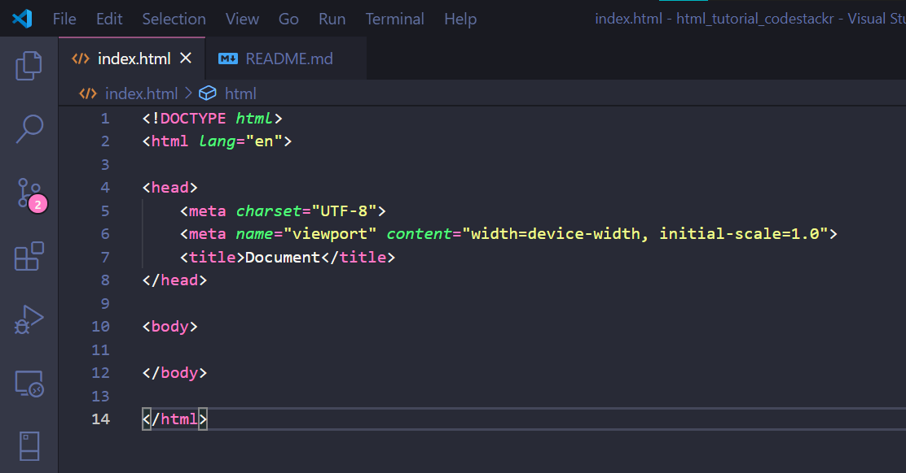
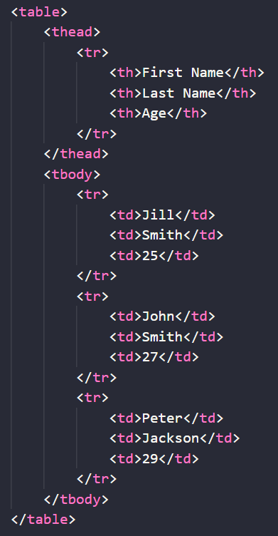
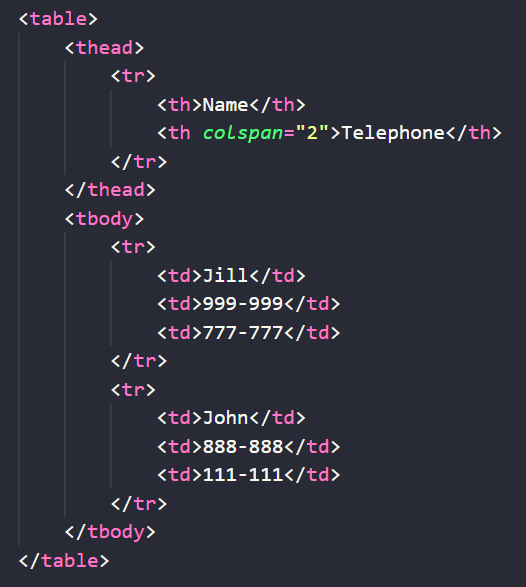
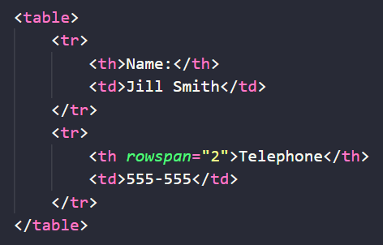
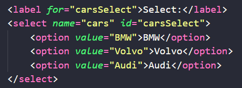

# codeSTACKr's HTML tutorial


Notes from codeSTACKr's HTML tutorial. You can watch the tutorial [here](https://www.youtube.com/watch?v=XiQ9rjaa2Ow).

## What is HTML?

HTML stands for HyperText Markup Language. It's the structure of a web page and it defines what the user sees. By default HTML is ugly. To style it we use CSS (Cascading Style Sheet).

HTML is not a programming language. It's a mark-up language. This means that there's no logic built into it. Just declarations.

## Getting started

Head on to VS Code. Open a new folder and create a file. Name it `index.html`. Now at the top of the file type an exclamation mark `!` and hit enter. This will create the basic HTML structure of the file.



HTML is composed of elements. Each element has a name and defined by its tags. Tags are declared with `<tag_name>` for opening tags, and `</tag_name>` for closing tags. A few elements don't require a closing tag. These are known as *self-closing elements*.

Elements can be nested inside each other. As many elements as needed can be nested. 

The first tag at the top of the `index.html` file is the `DOCTYPE`. This tag defines the language mark-up of the document to be HTML and tells the browser that this is a webpage.

The `<html>` element is the root element of the page. All other elements must be declared within it. Next is the `<head>` tag. This tag contains metadata about the page and style sheets. The metadata elements are used for SEO (Search Engine Optimization).

The `<title>` element specifies a title for the document. The title of the document will be displayed on the browser tab. This is the only element in the `<head>` of the document that will be visible to the user.

Next is the `<body>` element. Inside this element is where we'll place all the content of the document.

## Inline-level Vs Block-level elements

- Inline elements don't start a new line. They only take up the needed width. Some examples are `<span>`, ``, and `<a>`.

- Block elements start a new line and they take the full width available. Some examples are `<div>`, `<h1>` ... `<h6>`, `<p>`.

## Headings

There are 6 levels of headings in HTML: `<h1>` through `<h6>`. `<h1>` is used for headings, `<h2>` for sub-headings, as so on. Google uses top headings for SEO, so don't use headings just to make text bigger or bold. There are other ways of doing that.

## Paragraphs

Paragraphs are defined with the `<p>` tag. These are block-level elements. Space will be added before and after each paragraph, but spaces within the `<p>` tag will be ignored. To break a line, use the `<br>` tag (which is self-closing.)

We can format text by surrounding it with `<strong></strong>` (bold) or `<em></em>` (italics) tags. We can also achieve this by using `<b></b>` or `<i></i>` tags for bold or italics respectively. But this are old tags that are not **semantic** and should not be used.

Other text formatting tags are:

- `<mark>`: highlights the text

- `<small>`: makes the text small

- `<del>`: adds a strikethrough

- `<ins>`: underlines

- `<sub>`: subsripts

- `<sup>`: superscript

## Divs & Span

A division element `<div>` defines a section in the document. It is a block-level element that is used for making general purpose containers that separate groups of elements.

A `<span>` tag defines a section in a document inline.

## hr

`<hr>` stands for horizontal-rule. It adds a horizontal line in our document. It is used to separate sections of the document. `<hr>`s are self-closing tags.

## Attributes

Attributes are used to provide additional information about HTML elements. They need to be included in the opening tag of the element. They are composed of key-value pairs. The value should always be wrapped in quotation marks `"` or `'`.

For example, we can add a title to a paragraph like so: `<p title="This is a tooltip">`. Now, when the user hovers over the paragraph, a tooltip will appear on the screen displaying the message "This is a tooltip".

## img

The `` tag inserts an image in the document. Use the `src` attribute to specify the path to the image and the `alt` attribute sets a description of the image and is used by screen readers to improve accessibility and displayed if the image fails to load. Another attribute that we can add is `width`. This will set the width of the image.

Image tags are inline elements.

## Anchor

Anchor tags, `<a>`, create hyperlinks to content outside or within the page. The link to which the tag should point is defined in the `href` attribute. Using `href="#"` means that it will not go anywhere (it'll stay on the current page).

The content of the tag is what the user will see and should inform the user about where it'll be redirected to. When the user clicks on the hyperlink, it will open that page on the current browser tab. To change this behavior and have the user stay on our page we use the `target` attribute. If we set it to `target="_blank"` then a new browser tab will be opened when the user clicks on it.

Anchor tags are inline. They can be placed in any part of the webpage. We can even wrap them around an image and make the image a hyperlink.

## id attribute

We can add an `id` attribute to any tag. This creates a bookmark, a unique identifier of that particular tag. This bookmarks can be passed to the `href` attribute of an `<a>` tag like so: `<a href="#bookmark">` (note that there's no `target` attribute set). When the user clicks on this anchor, the browser will move the page to where the bookmark is.

## Lists

There are two types of lists. *Unordered* lists will be rendered as bullet points. *Ordered* list will be rendered as either Arabic numerals or Roman numerals. Use the `<ul>` tag to make an unordered list, or the `<ol>` to make an ordered list.

`<ol>`s can take a `type` attribute. This will change the numerals:

- `type="1"`: numeric

- `type="A"`: capital letters

- `type="I"`: capital romans

- `type="a"`: lowercase letters

- `type="i"`: lowercase romans

`<ol>` tags can also take a `start` attribute which will define the number at which they start. For example, `start="25"` will make the list start at number 25 and add from there.

Inside the list tag, we place list items by using the `<li>` tags. Sub lists can be added by nesting `<ul>` or `<ol>` elements inside an `<li>` element.

Lists are usually used to make navbars in webpages (with the help of some CSS).

## Tables

We declare table elements with the `<table>` tag. We use them the include tabular data, not to make layouts. To build a table we need to define two important sections: head and body. The head will be declared within the `<thead></thead>` tags, and the body within `<tbody></tbody>`. Inside each of them, we'll use the `<tr></tr>` tag to declare each line. Finally, the head will take table headings tags, `<th></th>`. Inside them, we'll put the values that will be displayed at the column headers of the table. Other rows will use `<td></td>` tags that will contain the table data (the value for each cell).



When declaring `<th>` tags we can use the `colspan` attribute to specify the number of columns that the header should span. Keep in mind that the number of cells that you'll need to create is equal to the sum of all `colspans` (by default, `colspan="1"` so the number of `<td>`s is equal to the number of `<th>`s).



Likewise, we can set the `rowspan` attribute to specify the number of rows that a value should take up. This is used when creating horizontal tables. Table values will still take 1 cell each.



Something that can be added to any table is a caption. We do so by adding a `<caption></caption>` tag between the `<table>` and `<thead>` tags. The caption will be added on top of the table.

## Form

We can build forms that will submit data to a server with just HTML. To do so we use the `<form>` element. This element takes an `action` attribute that specifies where the form is going to submit the data to. 

Inside the `<form>` tag we'll use the `<fieldset>` tag to group related elements within the form (it will draw a box around them). Inside the `<fieldset>` tag we use the `<legend>` tag to declare the title of that forms section.

After that, we use the `<input>` tag to generate input fields for the user to fill out. The `type` attribute controls the type of input. For example, `type="text"` makes a text box where the user can type. `<input>` tags also need a `name` attribute which will be sent to the server. The server will use this name to figure out what the input submitted represents. We can use the `value` attribute to specify what will be shown in the box. Since we usually won't know the value, we can leave it blank `value=""` or skip it altogether. If we set the `placeholder` attribute, the input field will show this value until the user starts typing. This is used to help the user understand what their input should be. It should contain a description or example.

To add radio buttons we set the `input="radio"`. All radio buttons of the same group must have the same `name` attribute. The user can only select one of the buttons in a group.

Another type of input is the `type="checkbox"`. Like radio buttons, checkboxes can be grouped together using the `name` attribute but, unlike radio buttons, the user can select more than one (or none of them).

Both radio buttons and checkboxes can take an attribute called `checked`. This attribute takes no value and will cause the button or box to be checked by default when the page is loaded.

To create dropdown menus we use the `<select>` tag. This tag takes a `name` attribute. Inside it, we need to place `<option>`s. These will take a `value` attribute, which is the value that will be sent to the server. The content is what the user will be displayed. The `<select>` tag can also take a `multiple` attribute. This is a key, with no value. If we include it, then the user will be able to select multiple inputs by pressing Ctrl. We can also add a `selected` attribute to the options that will cause them the be selected when the page loads.

To add a label before the dropdown list we use the `<label>` tag. This tag takes a `for` attribute that needs to be set to the `id` attribute of the element that the label is for.



An important input is the submit button. We create it like so: `<input type="submit" value="Submit">`. The value attribute is the label that the user will see on the button. When pressed, it will send the information to the server.

## Buttons

To include buttons we use the `<button>` tag. By default, the button will not trigger any actions. To add functionality to the button we need to use JavaScript.

## General guidelines

- use lowercase for element names

- use lowercase attribute names

- use lowercase filenames

- use camel case for names, classes, and IDs

- do not place spaces around the equal sign in attributes

- avoid long lines of code

- do not add blank without a reason. Blank lines should only be used to separate sections of code in order to improve readability.

 - indent your code with 2 or 4 spaces

 ## Comments

 Comments in HTML can be instered with `<!-- Comment -->`.

 ## Style

All tags can take a `style` attribute. Inside this attribut, we can define CSS properties that will change how the content of the tag looks. Nevertheless, all CSS styling should be included in a `.css` file and linked to our `.html` in the head by using:

 ``` html
<link rel="stylesheet" href="style.css">
 ```

Alternatively, we can use the `<style>` tag in the head to add CSS styling. But again, this is discouraged.

Style can then be passed to the required tags by using the `class` attribute and setting it to the name of the class selector.
